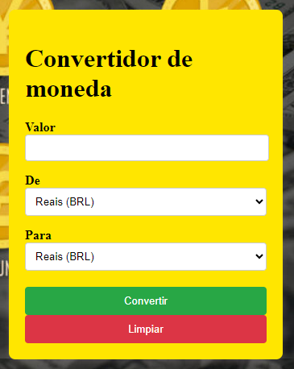

<h1>Convertidor de moneda </h1>



<h2>Este es un proyecto simple de conversor de divisas que permite al usuario convertir valores de una moneda a otra utilizando tipos de cambio actualizados en tiempo real.</h2>


 # FUNCIONALIDADES


* Conversión de moneda en tiempo real: Convierte valores entre múltiples monedas según el tipo de cambio actual.
* Fácil de usar para ingresar valores y seleccionar monedas de origen y destino.
* Actualizar automáticamente los tipos de cambio: los tipos se actualizan automáticamente, lo que garantiza una conversión precisa.

# tecnologias usadas 
* ## html
* ## javaScript
* ## git gub


# como instalar y ejecutar  

1. copie el repositorio

```
https://github.com/32leo/conversor-de-moeda?tab=readme-ov-file#conversor-de-moeda-
```
2. copie los codigos del javaSript


```
document.getElementById('currency-form').addEventListener('submit', function(event){
     event.preventDefault(); 
    const valor = parseFloat(document.getElementById('valor').value);
    const daMoeda = document.getElementById('daMoeda').value;
    const paraMoeda = document.getElementById('paraMoeda').value;


```


defini tasas de cambio fixas 

 ```
 const exchangeRates = {
        USD:{BRL:5.70, EUR:0.93},
        BRL:{USD:0.18, EUR:0.16},
        EUR:{USD:1.08, BRL:6.16}, 

 ```
conversión de moneda sencilla

```
let valorConvertido;
    if(daMoeda === paraMoeda){
        valorConvertido;
    }else{
        valorConvertido = valor * exchangeRates[daMoeda][paraMoeda];
    }

    const conversao = document.getElementById('conversao');
    conversao.textContent = `Resultado:${valorConvertido.toFixed(2)} ${paraMoeda}`;

});

```

realize un cidigo el en HTML para poder funcionar el cidogo


# COMO USAR
1. Seleccione la moneda de origen y la moneda de destino.

2. Ingrese el valor a convertir.

3. El programa mostrará el monto convertido según el tipo de cambio actual.

sitaciones:


creador:


