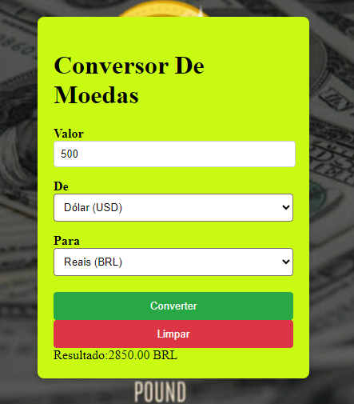

<h1>Conversor de moeda </h1>



<h2>Este é um projeto simples de Conversor de Moeda que permite ao usuário converter valores de uma moeda para outra usando taxas de câmbio atualizadas em tempo real.</h2>


 # FUNCIONALIDADES


* Conversão de moeda em tempo real: Converte valores entre diversas moedas com base na taxa de câmbio atual.
* fácil de usar para inserir valores e selecionar as moedas de origem e destino.
* Atualização automática das taxas de câmbio: As taxas são atualizadas automaticamente, garantindo uma conversão precisa.

# tecnologias usadas 
* ## html
* ## javaScript
* ## git gub


# como instalar e executar 

1. clone o repositorio

obter valores de entrada informados élo usuario

```
document.getElementById('currency-form').addEventListener('submit', function(event){
     event.preventDefault(); 
    const valor = parseFloat(document.getElementById('valor').value);
    const daMoeda = document.getElementById('daMoeda').value;
    const paraMoeda = document.getElementById('paraMoeda').value;


```